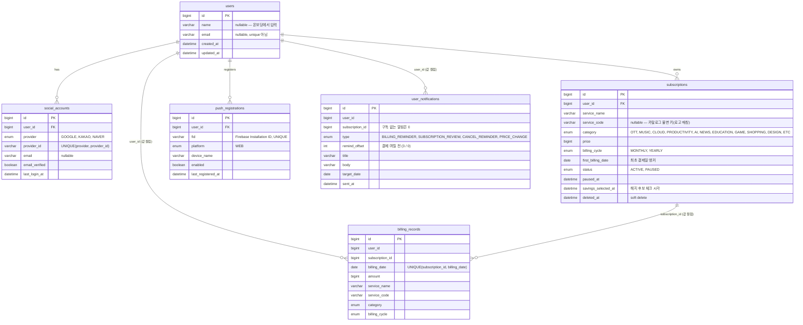

# Gudocs — 구독 서비스 통합 관리 대시보드

구독 중인 OTT, 음악, 클라우드, AI 툴 등 다양한 서비스를 한곳에서 관리하고,  
월별 지출을 분석하며, 결제·해지·가격 변경을 웹 푸시로 알려주는 웹 애플리케이션의 백엔드 서버입니다.

**Frontend Repository:** [gudocs-fe](https://github.com/SCRUMBLE-team/gudocs-fe)  
**API 문서 (Swagger):** [https://3-35-49-217.sslip.io/swagger-ui/index.html](https://3-35-49-217.sslip.io/swagger-ui/index.html)

---

## 프로젝트 정보

| 항목 | 내용 |
|------|------|
| 기간 | 2026.05 ~ |
| 인원 | 2명 |

### 팀원

| 이름                                      | 역할 |
|-----------------------------------------|------|
| [Gopistol](https://github.com/Gopistol) | 백엔드 |
| [2SEONGA](https://github.com/2SEONGA)   | 백엔드 |

---

## 기술 스택

| 구분 | 기술 |
|------|------|
| Language | Java 21 |
| Framework | Spring Boot 3.5 |
| ORM | Spring Data JPA |
| Database | MySQL 8 (운영) / H2 (로컬·테스트) |
| Migration | Flyway (`src/main/resources/db/migration`) |
| Auth | Spring Security OAuth2 (소셜 로그인 전용) + Spring Session JDBC |
| Push | Firebase Admin SDK (FCM Web Push) |
| OCR | NAVER CLOVA OCR |
| API 문서 | SpringDoc OpenAPI (Swagger UI) |
| Test | JUnit 5, Jacoco |
| Build | Gradle |
| Deploy | AWS EC2 · Caddy · GitHub Actions |

---

## 주요 기능

- **인증** — Google / Kakao / Naver 소셜 로그인 전용. 세션을 DB(Spring Session JDBC)에 저장해 재배포·재기동에도 로그인 유지
- **마이페이지** — 이름 수정(최초 로그인 온보딩 겸용), 회원 탈퇴 (구독·소셜계정·청구기록·푸시 데이터 함께 정리)
- **구독 관리** — 등록·수정·삭제(soft delete)·상태 전환(ACTIVE / PAUSED), 서비스명 중복 확인
- **서비스 카탈로그** — 국내 주요 구독 서비스·요금제·해지 링크 정적 카탈로그. 등록 시 요금 자동 완성, 프론트 로고 매칭 키(`service_code`) 제공
- **OCR 스캔** — 결제 알림·영수증 이미지에서 서비스명·금액·결제일을 파싱해 등록 폼을 채움
- **청구 스냅샷** — 청구 예정일이 도래하면 그 시점의 구독 등록정보를 `billing_records`에 한 줄로 고정. 지출 분석의 단일 소스
- **지출 분석** — 월별 지출(월평균 부담 / 기록 청구액), 카테고리별 비율, 추이, 월별 상세
- **대시보드** — 이번 달 지출·카테고리 요약·결제 예정 집계
- **절약하기** — 미사용·중복 구독 후보 제시, 해지 후보 체크 상태를 서버에 보관
- **웹 푸시 알림** — 결제 예정(D-3·당일), 구독 검사 유도(2주/4주 주기), 해지 알림, 공식 가격 변경 예고

---

## 시스템 아키텍처

```
[브라우저]
    │ HTTPS
    ▼
Vercel (gudocs-fe)                          Firebase Cloud Messaging
    │ fetch (credentials: include)                    ▲ FCM Web Push
    ▼                                                 │
AWS EC2 t3.micro (Ubuntu 22.04)                       │
  Caddy :443  →  Spring Boot :8080  ────────────────┬─┘
                        │                           └──► CLOVA OCR API
                        ▼
                   MySQL 8 :3306
```

- 세션 쿠키는 크로스 도메인(`SameSite=None; Secure`)으로 Vercel ↔ EC2 사이를 오간다
- Flyway가 앱 기동 시 마이그레이션을 자동 적용하므로 배포는 `systemctl restart gudocs` 하나로 끝난다
- 스케줄러(청구 스냅샷 배치, 알림 배치 3종)는 같은 인스턴스에서 cron으로 동작한다

### 패키지 구조

```
com.scrumble.gudocs/
├── auth/           # 소셜 로그인(oauth/), 로그아웃, 내 정보
├── users/          # User·SocialAccount, 마이페이지 (이름 수정, 탈퇴)
├── subscriptions/  # 구독 CRUD + catalog/(서비스·요금제·해지링크 카탈로그)
├── billing/        # billing_records 청구 스냅샷 (일일 배치 + 등록 시 추정 백필)
├── expense/        # 지출 분석 (월별, 카테고리별, 추이, 상세)
├── dashboard/      # 메인 대시보드 집계
├── notification/   # FCM Web Push (기기 등록 + 알림 배치/발송)
├── ocr/            # CLOVA OCR 기반 구독 정보 스캔
├── global/         # BaseEntity, ErrorCode, BusinessException, ApiResponse, security/
└── config/         # Security, CORS, Web, Firebase, DataInitializer(local)
```

계층: Controller → Service → Repository

---

## ERD



세션은 Spring Session JDBC가 관리하는 `spring_session` / `spring_session_attributes` 테이블에 저장된다(애플리케이션 코드가 직접 다루지 않음).

### 설계 포인트

- **소셜 계정 식별은 `provider + provider_id`** — 다른 제공자로 로그인하면 같은 이메일이라도 별도 회원이다. 그래서 `users.email`은 unique가 아니고, 카카오 이메일 미동의 계정을 위해 nullable이다
- **다음 결제일은 저장하지 않는다** — `first_billing_date`(앵커) + 주기로 `NextBillingDateCalculator`가 매번 계산한다(월말 드리프트 없음)
- **과거 지출은 `billing_records`에서만 읽는다** — 구독 테이블의 `price`·`category`·`status`는 *현재 값*이라, 사용자가 나중에 값을 고치면 과거 분석이 따라 움직인다. 청구 시점 값을 통째로 얼려 두면 필드별 변경 이력 테이블이 필요 없다
- **일시정지는 행의 부재로 표현된다** — 정지 중인 달은 스냅샷 행이 생기지 않아 그 달 지출이 0이다. 상태 이력 테이블 없이 정지/재개 반복이 저절로 맞는다
- **`billing_records`는 카드·은행의 실제 결제 증빙이 아니다** — 등록정보 기반 추정이며, 실제 승인 여부·금액 판정에 쓰지 않는다
- **알림 중복 방지는 DB 제약으로** — `UNIQUE(user_id, type, target_date, remind_offset, subscription_id)`. `subscription_id`는 NULL 대신 `0`을 쓴다(MySQL UNIQUE는 NULL을 서로 다른 값으로 취급해 dedup이 조용히 풀리기 때문)

---

## 실행

```bash
./gradlew build -x test                                      # 빌드
./gradlew bootRun                                            # 로컬 (MySQL)
./gradlew bootRun --args='--spring.profiles.active=local'    # H2 + mock data
./gradlew test                                               # 전체 테스트
```

`local` 프로파일은 H2 인메모리 + mock 사용자·구독 데이터를 자동 삽입하고, H2 콘솔(`/h2-console`)을 연다.

---

## CI/CD

- **`ci.yml`** — PR(main/develop) + develop push → 테스트 + 빌드
- **`deploy.yml`** — develop의 CI가 성공으로 끝났을 때(`workflow_run`) 또는 수동 실행 → 빌드 → SCP → `/etc/gudocs/env` 렌더링 → `systemctl restart gudocs`
  - 테스트를 통과한 그 커밋(`workflow_run.head_sha`)만 배포된다
  - Flyway가 기동 시 마이그레이션을 적용하므로 수동 SQL 실행이 필요 없다

외부 의존성(DB, OAuth 크레덴셜, CORS 허용 도메인, CLOVA OCR, Firebase 등)은 모두 `/etc/gudocs/env` 환경변수로 주입한다. 자세한 목록은 [`AGENTS.md`](AGENTS.md#배포) 참고.
